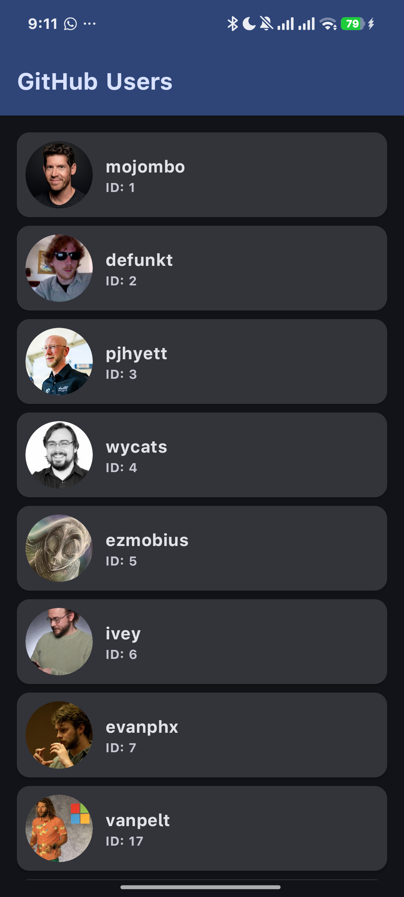

# Tugas11_Android_Internet_452024611053

Aplikasi Android yang menampilkan daftar user GitHub menggunakan Retrofit + Moshi + Coroutines + Glide + Jetpack Compose.

## Identitas

- **Nama**: FAZY
- **NIM**: 452024611053

## Screenshot

### Loading State

### Content Loaded

## Tech Stack

| Komponen | Teknologi |
|---|---|
| Bahasa | Kotlin |
| UI | Jetpack Compose (Material3) |
| HTTP Client | Retrofit 2.11.0 |
| JSON Parser | Moshi 1.15.2 (KSP codegen) |
| Async | Kotlin Coroutines (viewModelScope) |
| Image Loader | Glide 4.16.0 (Compose integration) |
| Arsitektur | MVVM |

## API

**Endpoint**: `https://api.github.com/users`

Response berisi array objek `User` dengan field: `login`, `id`, `avatar_url`.

Awalnya menggunakan `https://jsonplaceholder.typicode.com/photos` tetapi gambar dari `via.placeholder.com` gagal dimuat karena TLS error di perangkat. Diganti ke GitHub Users API yang gambar avatarnya berfungsi dengan baik.

## Fitur

- Menampilkan daftar user GitHub (avatar + login) dari internet
- Loading state dengan `CircularProgressIndicator`
- Error state dengan pesan error
- Placeholder image saat loading dan error image saat gagal
- Glide `@BindingAdapter` kustom untuk pemuatan gambar
- Avatar gambar berbentuk lingkaran (`CircleShape` + `circleCrop()`)

## Normal Permission vs Dangerous Permission

### Normal Permission (`INTERNET`, `ACCESS_NETWORK_STATE`)

- **Karakteristik**: Tidak mengancam privasi pengguna secara langsung. Izin ini hanya memungkinkan aplikasi mengakses jaringan internet dan membaca status koneksi.
- **Interaksi Pengguna**: Diberikan secara otomatis saat instalasi aplikasi. **Tidak ada dialog permintaan (runtime prompt)** yang muncul kepada pengguna.
- **Contoh lain**: `BLUETOOTH`, `VIBRATE`, `ACCESS_WIFI_STATE`, `SET_WALLPAPER`.

### Dangerous Permission (`CAMERA`, `LOCATION`, `READ_CONTACTS`)

- **Karakteristik**: Berpotensi mengakses data pribadi atau sensitif pengguna, seperti kamera, lokasi GPS, atau kontak.
- **Interaksi Pengguna**: Harus diminta secara eksplisit saat runtime melalui dialog Android. Pengguna dapat **menolak** permintaan izin kapan saja. Di Compose, digunakan `rememberLauncherForActivityResult(ActivityResultContracts.RequestPermission())`.
- **Contoh lain**: `ACCESS_FINE_LOCATION`, `RECORD_AUDIO`, `READ_EXTERNAL_STORAGE`, `SEND_SMS`.

### Ringkasan

| Aspek | Normal Permission | Dangerous Permission |
|---|---|---|
| **Contoh** | `INTERNET` | `CAMERA` |
| **Runtime Prompt** | Tidak | Ya |
| **Dapat ditolak user** | Tidak (otomatis) | Ya |
| **Dicabut sistem** | Tidak | Ya (Android 11+) |
